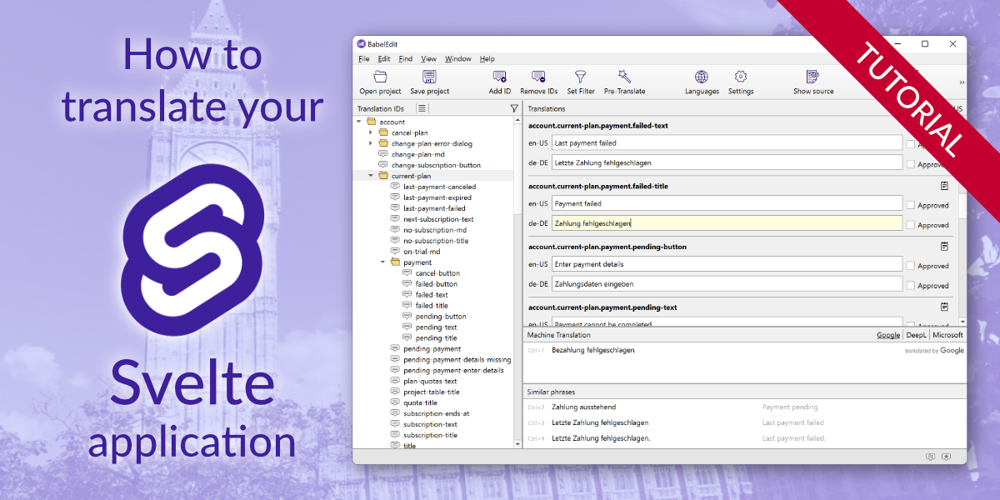

# Svelte Translation Example

This is the example project for the tutorial
[How to translate your Svelte Web App](https://www.codeandweb.com/babeledit/tutorials/how-to-translate-your-svelte-web-app)

To start the demo run

~~~
npm install
npm run dev -- --open
~~~
